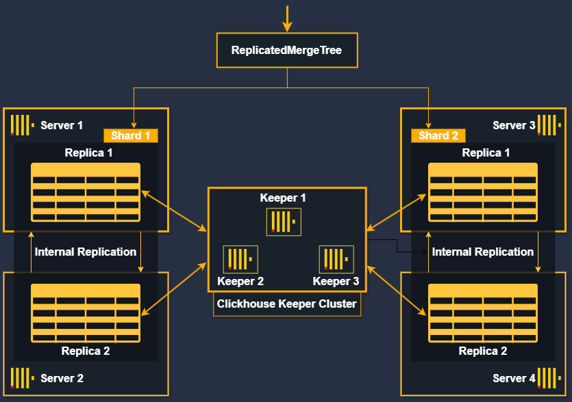

# clickhouse-cluster

## Background

To run clickhouse in development env it will be ok to run the server standalone. For production like environments it is recommended to run the clickhouse server in cluster mode. Cluster mode will have multiple clickhouse servers communicating with one another via clickhouse keeper or zookeeper can also be used in place.

To run the clickhouse in cluster mode generally clickhouse suggests to use clickhouse cloud. However it can be hosted in custom machines. This code base implements the infrastructure to setup custom hosted clickhouse cluster.

## Description

Before looking into the implementations let's keep in mind that each docker container is as standalone server. I have used containers for easier setup, these machines can be `lxc containers`, `Vms`, or any other machine.

> [ Note ] : No matter the servers or containers, each of the machines should be connected to the same network and communication between these machines should be done using host name.

So, let's treat each containers as a standalone server, they are in same network and can communicate with each other using host names.

## Architecture Diagram



- Here are `4 clickhouse servers` they are connected to the same network and can communicate with each other using host names.
- Each server have clickhouse running on them, and can be accessed on port `8123`.
- For the `clickhouse keeper server`, we are using a cluster of 3. Each of the 3 keeper server will have clickhouse keeper running.
- There will be 2 shards and in each shards, they will have 2 replicas of the data `(Replica1 and Replica2)`.
- Among the replicas and the shards data will be replicated using internal replication via clickhouse keeper servers.

## Configuration

> [ NOTE ] : Here For each server we have separate configuration files. This is for simplicity only. In most cases the content among the configuration files is same, with simple change. i.e server_id is different.

> [ NOTE ] : TO avoid the use of each configuration file in each server, we can use scripting to generate the configuration according the server we use.

### Server Configuration

- Server configuration have two folders `server` and `user`.
- The server folder holds all the configurations that are needed to configure server and connect the server to the cluster.
- The `cluster.xml` file is used to configure the server and connect the server to the cluster `(application_cluster)`, this cluster will be created by default.
- The `macros.xml` file holds the metadata to there server.
- Clickhouse holds the configuration files on `/etc/clickhouse-server/config.d/` path and these files will be mounted to the path on servers startup.

- The `user` folder holds the configuration of the user accounts for the clickhouse cluster.
- Clickhouse holds the configuration files on `/etc/clickhouse-server/users.d/` path and these files will be mounted to the path on servers startup.
- It will create `3 users`, `admin` , `developer`, `manager` on the clickhouse cluster and these users ill have `RBAC` as defined on the `user.xml` file.
- To add new users we can update the `user.xml` file and restart the server.

> [ NOTE ]: For user creation, this is not the recommended approach suggested by clickhouse. Clickhouse suggests to use SQL approach to create users and RBAC instead of xml files, because xml files should be copied to each server participating on the cluster. Also, due to security reasons it is not recommended.

## Running the cluster

### Requirements

| Name   | Version  |
| ------ | -------- |
| docker | >= 24.0. |
| aws    | >= 2.12. |

### Running locally

- Starting the cluster

```
make create-clickhouse-cluster

## Once the server is up connect to the server with clickhouse-client

clickhouse-client --user <user_name> --password <password>

```

- Stopping the cluster

```
make stop-clickhouse-cluster
```

## Improvements

- This cluster will run with 4 clickhouse server and 3 clickhouse keeper server. However, further improvements can be done on this.
- SSL/TLS can be used to secure the communication between the servers, as well as for the communication between user and the servers.
